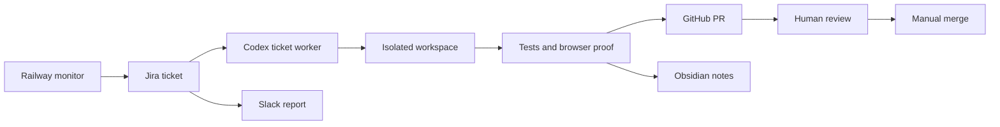

# SpeakerAgent Ops Agent

Always-on engineering operations agent for SpeakerAgent.ai.

Public repo:

```text
https://github.com/jbellsolutions/speakeragent-ops-agent
```

This repo gives Lester a safe Railway-hosted monitor that checks the site and API, records Jira tickets, writes Obsidian-compatible infrastructure notes, and posts a daily Slack report at 4:00 a.m. Eastern.

It is intentionally conservative: it does **not** auto-merge, auto-deploy, or change production. It creates evidence, Jira tickets, reports, and improvement proposals so Codex or a human can fix the right thing with review.

## Symphony-Style Jira Control Plane

This repo follows the Symphony operating model from OpenAI and the [OpenAI Symphony walkthrough video](https://www.youtube.com/watch?v=M_AmPWmkpwA): manage work at the ticket level, keep the workflow in the repo, run each implementation in an isolated workspace, and require proof before human review.

This adaptation is Jira-first:

- Jira replaces Linear as the durable state machine.
- Railway creates and updates operational Jira tickets.
- Codex works from Jira tickets and opens GitHub PRs against the product repos.
- Obsidian stores durable reports, architecture notes, and learning.
- Slack receives daily and failure summaries.
- Humans review proof packets and merge manually.



The repo-level workflow contract lives in [`WORKFLOW.md`](WORKFLOW.md). The full Jira adaptation is documented in [`docs/SYMPHONY_JIRA_GUIDE.md`](docs/SYMPHONY_JIRA_GUIDE.md).

## What It Checks

- Site runtime and uptime.
- API runtime when `TARGET_API_URL` is configured.
- Broken links from the public homepage.
- Browser smoke checks with headless Chromium.
- Browser console errors, page errors, and failed requests.
- Daily engineering suggestions.
- Daily skill/workflow improvement proposals.

## What It Produces

- Slack alert when a runtime check fails.
- Slack daily report every day at 4:00 a.m. Eastern.
- Jira tickets for runtime failures.
- Obsidian-compatible Markdown notes.
- Optional OpenAI-powered council reports when `OPENAI_API_KEY` is configured.

## Architecture Decision

Use Railway for always-on runtime.

Use deterministic checks first. Use OpenAI/Codex-style analysis second. Do not use Cursor SDK in v1.

Why:

- Railway is the safe hosted environment, so the agent is not running on Lester's computer.
- Deterministic uptime, link, and browser checks are more reliable than asking an AI if the site is up.
- Jira is the control plane for fixes.
- GitHub remains the code and PR layer.
- Obsidian Markdown notes are the memory layer.
- Cursor SDK can be reconsidered later, but it adds another paid runner, another API key, and another place for work to happen.

## Quick Start For Lester

### 1. Create The GitHub Repos

You need:

- This public repo for the ops agent.
- The SpeakerAgent frontend repo, when it is available.
- The SpeakerAgent backend repo, when it is available.
- A private Obsidian notes repo, recommended name: `speakeragent-ops-vault`.

The Obsidian repo should be private if it may contain operational details.

### 2. Create Jira, GitHub, And Slack Access

Jira is where the agent files runtime tickets. Configure a Jira project for operational work, then use a Jira API token for the Railway service.

Required Jira values:

- Jira base URL, for example `https://example.atlassian.net`.
- Jira account email.
- Jira API token.
- Jira project key, for example `SA`.
- Jira issue type, usually `Bug` or `Task`.

Create a GitHub fine-grained token with access to:

- The Obsidian notes repo.
- The frontend/backend repos later, when Codex starts opening PRs.

Required permissions:

- Contents: read/write.
- Metadata: read.

GitHub Issues are not the normal ticket system for this repo anymore. `GITHUB_ISSUES_REPO` remains as a fallback only if Jira is not configured.

Create a Slack incoming webhook for the channel where daily reports should land.

Optional: create an OpenAI API key if you want AI council and workflow-factory suggestions.

### 3. Deploy On Railway

1. Open Railway.
2. Create a new project.
3. Choose **Deploy from GitHub repo**.
4. Select or paste this repo:

```text
https://github.com/jbellsolutions/speakeragent-ops-agent
```

5. Railway will detect the Dockerfile and run the service.
6. Add the environment variables below.
7. Deploy.

Railway will use `railway.json` for the health check and restart policy.

### 4. Add Environment Variables

Minimum useful production setup:

```bash
TARGET_SITE_URL=https://speakeragent.ai/
TARGET_API_URL=
SLACK_WEBHOOK_URL=https://hooks.slack.com/services/...
JIRA_BASE_URL=https://example.atlassian.net
JIRA_EMAIL=ops@example.com
JIRA_API_TOKEN=...
JIRA_PROJECT_KEY=SA
JIRA_ISSUE_TYPE=Bug
JIRA_LABELS=speakeragent-ops,monitoring
JIRA_COMPONENT=
JIRA_PRIORITY_CRITICAL=
JIRA_PRIORITY_WARNING=
JIRA_PRIORITY_INFO=
GITHUB_TOKEN=github_pat_...
GITHUB_ISSUES_REPO=
OBSIDIAN_GITHUB_REPO=jbellsolutions/speakeragent-ops-vault
OBSIDIAN_GITHUB_BRANCH=main
OBSIDIAN_VAULT_PATH=SpeakerAgent Ops
OPENAI_API_KEY=
OPENAI_MODEL=gpt-5.5
RUN_SCHEDULER=true
UPTIME_INTERVAL_SECONDS=300
DAILY_REPORT_HOUR_EASTERN=4
DRY_RUN=true
ADMIN_TOKEN=make-a-long-random-string
BROWSER_CHECK_ENABLED=true
MAX_LINKS=80
REQUEST_TIMEOUT_SECONDS=20
```

Start with `DRY_RUN=true`. That lets the service check the site and write local logs without creating Jira tickets or Obsidian commits. After `/status` looks correct, set:

```bash
DRY_RUN=false
```

### 5. Verify It Is Running

Open:

```text
https://YOUR-RAILWAY-DOMAIN/healthz
```

Expected response:

```json
{"ok":"true","service":"speakeragent-ops-agent"}
```

Then open:

```text
https://YOUR-RAILWAY-DOMAIN/status
```

That shows scheduler state, dry-run state, targets, and the latest report.

### 6. Trigger A Manual Daily Run

```bash
curl -X POST https://YOUR-RAILWAY-DOMAIN/run/daily \
  -H "Authorization: Bearer YOUR_ADMIN_TOKEN"
```

### 7. Open Notes In Obsidian

Clone the private notes repo locally and open it as an Obsidian vault:

```bash
git clone https://github.com/jbellsolutions/speakeragent-ops-vault.git
```

The agent writes notes under:

```text
SpeakerAgent Ops/YYYY-MM-DD/
```

The recommended vault structure is documented in `docs/OBSIDIAN_BACKEND.md`.

## Safety Model

This service can:

- Check runtime health.
- Check links.
- Run a headless browser smoke test.
- Create Jira tickets.
- Write Markdown notes.
- Post Slack messages.
- Generate suggestions.

This service cannot:

- Merge pull requests.
- Deploy production.
- Edit production environment variables.
- Send outreach emails.
- Change billing.
- Install Cursor agents.
- Run on Lester's computer.

## Codex, Cursor, Or A Different Harness?

For v1, use this Railway service plus Jira.

Codex should be used to work Jira tickets, create PRs, review diffs, and improve the product. The always-on service should not try to be the coding agent itself.

Cursor SDK is not included in v1. It may be useful later for isolated cloud PR workers, but only after the deterministic monitoring and Jira ticket loop has proven itself.

## Local Development

```bash
python3 -m venv .venv
source .venv/bin/activate
pip install -r requirements.txt
playwright install chromium
cp .env.example .env
uvicorn app.main:app --reload
```

Run tests:

```bash
pytest
```

Run one check locally:

```bash
python -m app.cli uptime
python -m app.cli daily
```

## Important Files

- `app/main.py` - FastAPI app and manual run endpoints.
- `app/scheduler.py` - uptime and daily scheduling loops.
- `app/checks.py` - HTTP, link, and browser checks.
- `app/runner.py` - orchestration for uptime and daily runs.
- `app/jira_client.py` - Jira ticket creation and deduplication.
- `app/github_client.py` - GitHub fallback issue creation and note file writes.
- `app/ticketing.py` - ticket backend selection.
- `app/obsidian.py` - Obsidian Markdown storage.
- `WORKFLOW.md` - Symphony-style Jira operating contract for Codex workers.
- `docs/SYMPHONY_JIRA_GUIDE.md` - video-guided Symphony adaptation for Jira.
- `docs/JIRA_SETUP.md` - Jira project and token setup.
- `docs/OBSIDIAN_BACKEND.md` - Obsidian vault backend setup.
- `docs/` - setup, safety, and runbooks.

## Railway Notes

Railway services are containers. This repo ships a Dockerfile, so Railway builds from the Dockerfile. The service is persistent and always running, not a Railway cron job, because it needs uptime checks throughout the day plus one daily report.

## License

MIT
